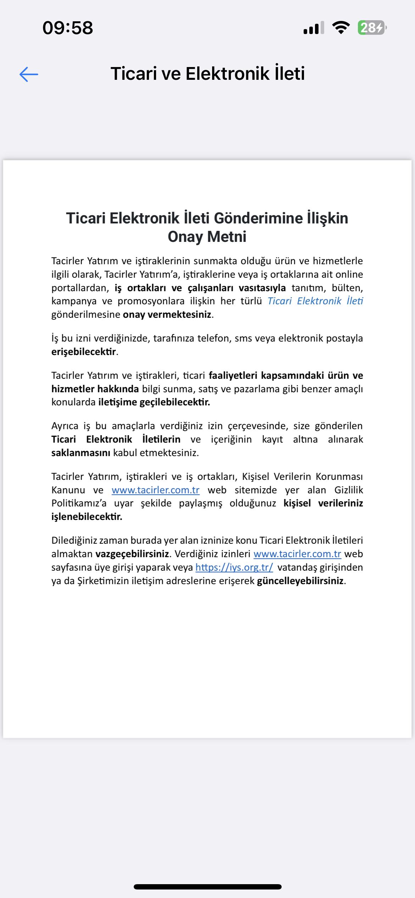
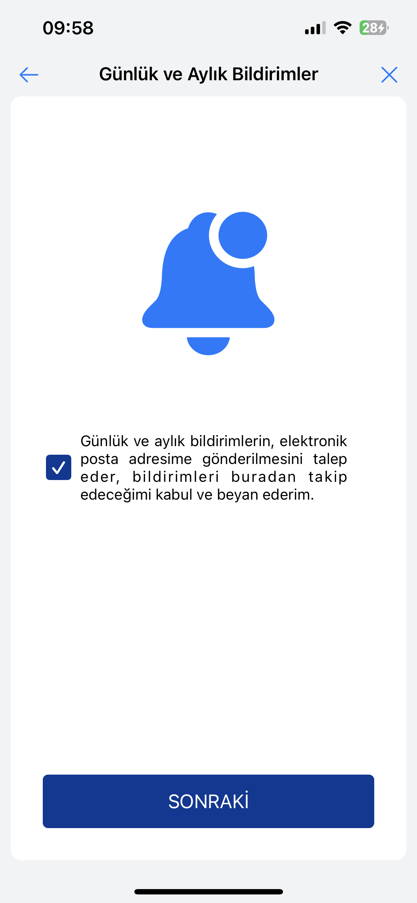

# TacirlerSDK

[](https://cocoapods.org/)

## Requirements

- +iOS 13.0

## Installation

TacirlerSDK is available through [CocoaPods](https://cocoapods.org). To install
it, simply add the following lines to your Podfile:

```ruby
# Uncomment the next line to define a global platform for your project
platform :ios, '13.0'

target 'tacirler-demo-project' do
  # Comment the next line if you don't want to use dynamic frameworks
  use_frameworks!

  # Pods for tacirler-demo-project
  pod 'TacirlerSDK'

end

post_install do |installer|
  installer.generated_projects.each do |project|
        project.targets.each do |target|
            target.build_configurations.each do |config|
                config.build_settings['IPHONEOS_DEPLOYMENT_TARGET'] = '13.0'
             end
        end
 end
end
```

## Configuration

- In target app select `Signing & Capabilities` tab and click `+Capability` button and add `Near Field Communication Tag Reading` capability.
- Add your Info.plist file necessary permissions;

```
<!--
FOR NFC
-->
<key>com.apple.developer.nfc.readersession.iso7816.select-identifiers</key>
<array>
    <string>A0000002471001</string>
</array>
<key>NFCReaderUsageDescription</key>
<string>Permission string</string>

<!--
FOR Camera
-->
<key>NSCameraUsageDescription</key>
<string>Permission string</string>
<key>NSMicrophoneUsageDescription</key>
<string>Permission string</string>

```

- Make sure you have these lines in your `.entitlements` file;

```
<dict>
    <key>com.apple.developer.nfc.readersession.formats</key>
    <array>
        <string>TAG</string>
    </array>
</dict>
```

## Usage

First import the SDK;

```swift
import TacirlerSDK
```

Then, create a view controller object to start cycle;

```swift
let vc = TacirlerSDKViewController()
```

Then, handover this view controller to a button. For example;

```swift
@objc func nextClicked() {
    vc.modalTransitionStyle = .coverVertical
    vc.modalPresentationStyle = .fullScreen
    present(vc, animated: true)
}
```

- `x` buttons on the screen is to `dismiss` the SDK. Also, when cycle ends, `home` button is to `dismiss` SDK.

## SDK Flow

#### KVKK Approval Screen


User needs to check both checkmark to proceed.

#### KVKK Policy and Commercial and Electronic Message Screens




#### MASAK Statement Screen


#### Daily and Monthly Notifications Screen


User needs to check checkmark to proceed.

#### NFC Availability Check Screen


In this screen NFC Availability control should be done, otherwise, user cannot proceed.

#### Form Screen


User needs to fill the form to proceed

#### Questionnaire Screen


User needs to choose one option to proceed. If they choose other or "Tacirler Investment Personal", user needs to fill text field.

#### Phone Number Screen


#### SMS OTP Code Screen


#### MRZ Scanner Screen


TR Identity card should be shown to the camera to proceed.

#### NFC Reader Screen


TR Identity card should be shown to backside of the phone to proceed.

#### Information Check Screen


#### Selfie Screen


#### Selfie Check Screens


#### Address Verification Screens


1. Verification with Place of Residence
   


QR Code that is on the place of residence form can be scanned.

2. Verification with Address No from E-devlet
   

#### Client Information Screen


#### Video Call Screens


#### Result Screens


Application failed


Application succeded

## Author

Papilon Savunma
